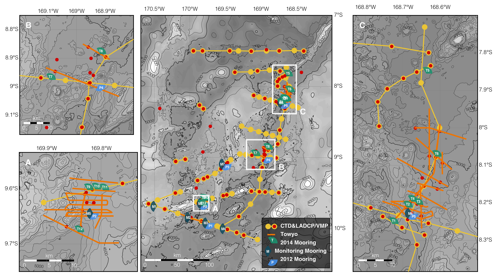

[](https://zenodo.org/badge/latestdoi/545141744) 
[](https://datalad.org)

# Samoan Passage Data Archive

This is the parent repository for data archives from the NSF-funded research projects on the abyssal flow through the Samoan Passage. The repository consists of the following subdatasets that can either be accessed individually via the following links or by cloning this repository using DataLad. More on how to [clone the datasets with DataLad / git-annex](#datalad-datasets-and-how-to-use-them) below. 

- [Bathymetry](https://github.com/gunnarvoet/sp-data-archive-bathy)
- [Towyos](https://github.com/gunnarvoet/sp-data-archive-towyo)
- [Stationary CTD/LADCP](https://github.com/gunnarvoet/sp-data-archive-ctd)
- [Moored Profilers](https://github.com/gunnarvoet/sp-data-archive-mp)

Turbulence microstructure data haven been archived at [microstructure.ucsd.edu](https://microstructure.ucsd.edu/#/).

### Dataset Overview


### Citing the Data
All datasets listed here have a [Creative Commons Zero 1.0 Universal Public Domain Dedication](https://creativecommons.org/publicdomain/zero/1.0/) which basically means you can use the data any way you like.
However, there are several ways to cite the data or associated scientific publications. Each subdataset has an associated doi, see the `CITATION.cff` files in the repositories for further information.
If you work with more than one of the subdatasets, you can also cite the data using the doi for this parent repository (10.5281/zenodo.7226653).
Depending on your research scope and the data you will be using, you may also want to consider citing one or more of the following papers:

Alford, M. H. , Girton, J. B. , Voet, G. , Carter, G. S. , Mickett, J. B. , and Klymak, J. M. (2013). Turbulent mixing and hydraulic control of abyssal water in the Samoan Passage, Geophys. Res. Lett., https://doi.org/10.1002/grl.50684.

Voet, G. , Girton, J. B. , Alford, M. H. , Carter, G. S. , Klymak, J. M. , and Mickett, J. B. (2015). Pathways, Volume Transport and Mixing of Abyssal Water in the Samoan Passage, J. Phys. Oceanogr., https://doi.org/10.1175/JPO-D-14-0096.1.

Voet, G. , Alford, M. H. , Girton, J. B. , Carter, G. S. , Mickett, J. B. , and Klymak, J. M. (2016). Warming and weakening of the abyssal flow through Samoan Passage, J. Phys. Oceanogr., https://doi.org/10.1175/JPO-D-16-0063.1.

Carter, G. S. , Voet, G. , Alford, M. H. , Girton, J. B. , Mickett, J. B. , Klymak, J. M. , Pratt, L. J. , Pearson-Potts, K. A. , Cusack, J. M. , and Tan, S. (2019). A spatial geography of abyssal turbulent mixing in the Samoan Passage, Oceanography, https://doi.org/10.5670/oceanog.2019.425.

Cusack, J. M. , Voet, G. , Alford, M. H. , Girton, J. B. , Carter, G. S. , Pratt, L. J. , Pearson-Potts, K. , and Tan, S. (2019). Persistent Turbulence in the Samoan Passage, J. Phys. Oceanogr., https://doi.org/10.1175/JPO-D-19-0116.1.

Girton, J. B. , Mickett, J. B. , Zhao, Z. , Alford, M. H. , Voet, G. , Cusack, J. M. , Carter, G. S. , Pearson-Potts, K. A. , Pratt, L. J. , Tan, S. , and Klymak, J. M. (2019). Flow-Topography Interactions in the Samoan Passage, Oceanography, https://doi.org/10.5670/oceanog.2019.424.


### Getting Help
If you discover a bug or have a question about any of the data, please submit an issue in the respective sub-repository.

--------------------------------------------------------------------------------

### DataLad datasets and how to use them

This repository is a [DataLad](https://www.datalad.org/) dataset. It provides
fine-grained data access down to the level of individual files, and allows for
tracking future updates. In order to use this repository for data retrieval,
[DataLad](https://www.datalad.org/) is required. It is a free and
open source command line tool, available for all major operating
systems, and builds up on Git and [git-annex](https://git-annex.branchable.com/)
to allow sharing, synchronizing, and version controlling collections of
large files. You can find information on how to install DataLad at
[handbook.datalad.org/en/latest/intro/installation.html](http://handbook.datalad.org/en/latest/intro/installation.html).

#### Get the dataset

A DataLad dataset can be `cloned` by running

```
datalad clone <url>
```

Once a dataset is cloned, it is a light-weight directory on your local machine.
At this point, it contains only small metadata and information on the
identity of the files in the dataset, but not actual *content* of the
(sometimes large) data files.

#### Retrieve dataset content

After cloning a dataset, you can retrieve file contents by running

```
datalad get <path/to/directory/or/file>`
```

This command will trigger a download of the files, directories, or
subdatasets you have specified.

DataLad datasets can contain other datasets, so called *subdatasets*.
If you clone the top-level dataset, subdatasets do not yet contain
metadata and information on the identity of files, but appear to be
empty directories. In order to retrieve file availability metadata in
subdatasets, use `-n` flag like so:

```
datalad get -n <path/to/subdataset>
```

Afterwards, you can browse the retrieved metadata to find out about
subdataset contents, and use `datalad get` once again (no flag this time) to retrieve individual files.
If you use `datalad get <path/to/subdataset>`, all contents of the
subdataset will be downloaded at once.

#### Stay up-to-date

DataLad datasets can be updated. The command `datalad update` will
*fetch* updates and store them on a different branch (by default
`remotes/origin/master`). Running

```
datalad update --merge
```

will *pull* available updates and integrate them in one go.

#### Find out what has been done

DataLad datasets contain their history in the ``git log``.
By running ``git log`` (or a tool that displays Git history) in the dataset or on
specific files, you can find out what has been done to the dataset or to individual files
by whom, and when.

#### More information

More information on DataLad and how to use it can be found in the DataLad Handbook at
[handbook.datalad.org](http://handbook.datalad.org/en/latest/index.html). The chapter
"DataLad datasets" can help you to familiarize yourself with the concept of a dataset.

